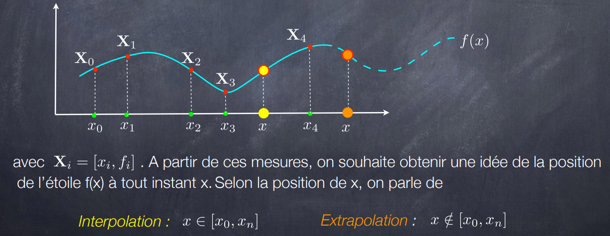

# Projects_NUM_ANALYSIS

*[Integ.py](#Integ.py)
 *[Mine.py](#Mine.py)
 *[RungePh.py](#RungePh.py)
 *[tk_gui.py](#tk_gui.py)

## Mon Projet: Phenomène de  Runge 

   
# Polynôme d’interpolation de Lagrange
>Interpolation : qu’est-ce que c’est et à quoi ça sert ?
Vous êtes astronome dans le 15ième siècle et vous étudiez le mouvement des étoiles à
l’aide d’un télescope. Chaque nuit pas forcément à la même heure vous mesurez la position
d’une même étoile de manière précise, ce qui vous donne un tableau de points de mesure 
> 
>### Sous forme graphique
>
