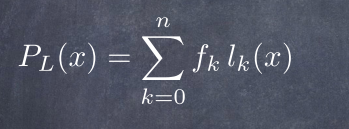
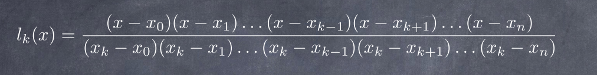
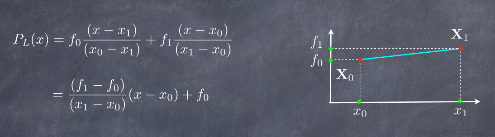
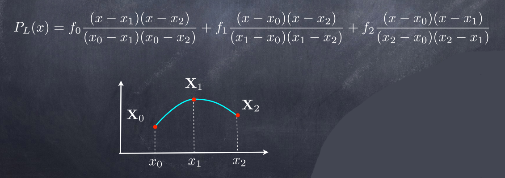

# Projects_NUM_ANALYSIS

- [Integ.py](#Integ.py)
- [Mine.py](#Mine.py)
- [RungePh.py](#RungePh.py)
- [tk_gui.py](#tk_gui.py)

## Mon Projet: Phenomène de  Runge 

   
# Polynôme d’interpolation de Lagrange
>Interpolation : qu’est-ce que c’est et à quoi ça sert ?
Vous êtes astronome dans le 15ième siècle et vous étudiez le mouvement des étoiles à
l’aide d’un télescope. Chaque nuit pas forcément à la même heure vous mesurez la position
d’une même étoile de manière précise, ce qui vous donne un tableau de points de mesure 
> 
>### Sous forme graphique
>

### Formule
>Le polynôme d’interpolation de Lagrange est le polynôme unique d’ordre n, qui
passe exactement par ces (n+1) points
> 
> 
> 
## 1.2. Quelques exemples simples
>  Le polynôme de Lagrange, passant par 2 points, est une droite 
> 
>  Le polynôme de Lagrange, passant par 3 points, est un parabole
> 
## 1.3 Estimation de l’erreur
>  Si on approche une fonction f(x) par un polynôme d’interpolation, on fera évidemmentn des erreurs : 
> 
